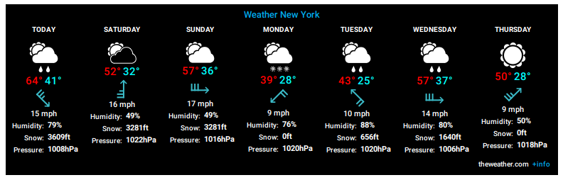
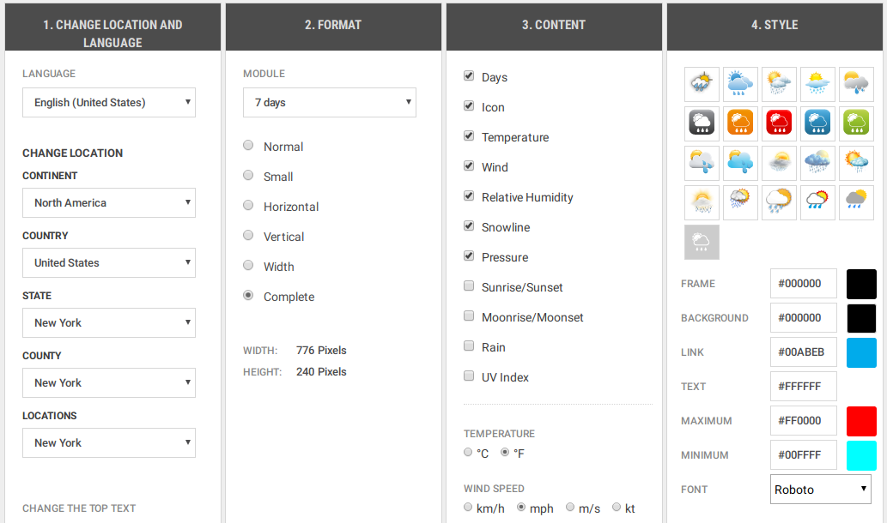

# RasPiSmartMirrorGUI (Python 3)
_SmartMirror for RaspberryPi_<br>
[_**\[Bottom\]**_](#bottom)<br>
**Important:** Actually crontab does'nt do what I want... Run python3 /opt/SM_GUI_v0.3.1-py3.5-tk/SM_GUI_v0.3.1.minimal.py manually.
## Content
**_\[ [&uarr;](#top)_ / _[&darr;](#bottom) \]_**
### Project
**_\[ [&uarr;](#top)_ / _[&darr;](#bottom) \]_**

| No. | Title | Status |
| :--- | :--- | :---: |
| 1. | [python3 installer](python3/setup_latest.sh) | finished |
| 2. | [python3 GUI (0.3.1)](python3/SM_GUI_v0.3.1.minimal.py) | finished |
| 3. | [html installer]() | work in progress |
| 4. | [html python3 query]() | work in progress |
| 5. | [html GUI]() | work in progress |
### Documentation
**_\[ [&uarr;](#top)_ / _[&darr;](#bottom) \]_**

| No. | Title |
| :--- | :--- |
| 1. | [Content](#content) |
| 1.1 | [Project](#project) |
| 1.2 | [Documentation](#documentation) |
| 2. | [About](#about) |
| 3. | [Installation](#installation) |
| 4.1. | [Download setup.sh](#download-setupsh) |
| 4.2. | [Required setup](#required-setup) |
| 4.2.1. | [Software](#software) |
| 4.2.1. | [Configuration (Python)](#configuration-python) |
| 4.2.1.1. | [Weather Widget](#weather-widget) |
| 4.2.2. | [Hardware](#hardware) |
| 5. | [Future plans](#future-plans) |
| 6. | [HTML Version](#html-version-of-the-smartmirrorgui) |
## About
**_\[ [&uarr;](#top)_ / _[&darr;](#bottom) \]_**<br>
The SmartMirrorGUI uses python 3 (Im using 3.5.3) in combination with tkinter to display a black fullscreen with (not :P) useful things on it like the weather, the time and a random cartoon from Ruthe.de (or other if you configure it).<br>
In future I want to display the outside/ inside temperature and the CPU temperature (in °C).
## Installation
**_\[ [&uarr;](#top)_ / _[&darr;](#bottom) \]_**<br>
### Download setup.sh
**_\[ [&uarr;](#top)_ / _[&darr;](#bottom) \]_**<br>
There are 3 ways to get the setup:
- Download the latest setup [here](python3/setup_latest.sh).
- You can also just copy the text and paste it in any **\*.sh** file.
- The third option is using **wget** (`wget https://raw.githubusercontent.com/Schn33W0lf/RasPiSmartMirrorOS/master/python3/setup_latest.sh --output-document=/home/$USER/Downloads/SmartMirrorOS_installer.sh`)
### Required setup
**_\[ [&uarr;](#top)_ / _[&darr;](#bottom) \]_**<br>
#### Software
**_\[ [&uarr;](#top)_ / _[&darr;](#bottom) \]_**<br>
1. Download an operating System. I have tested it with Noobs and Raspbian stretch.
2. Make sure that your system boots automaticly in Desktop (and logging in) (`sudo raspi-config`, 3 Boot options, B4 Desktop Autologin)
3. Download the installer
4. run it as root (`sudo bash /path/to/SmartMirrorGUI.sh`). **Important** is, that you use **sudo** and **bash**, not sh.
##### Configuration (python)
**_\[ [&uarr;](#top)_ / _[&darr;](#bottom) \]_**<br>
###### Weather widget
**_\[ [&uarr;](#top)_ / _[&darr;](#bottom) \]_**<br>
1. Open the python file (as root) and search for `SmartMirrorGUI.configs`. It should be in Line 108.
2. Edit the last (`SmartMirrorGUI.configs[7]`) list item. By default it is `foto99e83cda40fd2d3cd0a4d11485dffca2`. Its the default weather image url.
3. To edit visit https://www.theweather.com/widget/.
4. Configure the widget like this:
[](python3/examples/SmartMirror_weather_example.png)<br>
It should look like this:
[](python3/examples/SmartMirror_weather_example_config.png)
5. Enter your email and copy the last characters (after `https://www.theweather.com/wimages/`) of the link
6. Paste it in the python script.
#### Hardware
**_\[ [&uarr;](#top)_ / _[&darr;](#bottom) \]_**<br>
Basicly, you need the RaspberryPi 3 with a µSD-card and a power supply (I suggest to use the official one (5V_, 2.5A) because because of the voltage drop inside the Pi. More in the RPi Forum and [here](https://www.raspberrypi.org/documentation/hardware/raspberrypi/power/README.md)). Im using the RPi 3 B Rev 1.2<br>
Additionally you can solder a perfboard or just connect the status LED and switches with jumper wires. You can find circuit diagrams, plans and other infos [here](hardware)
## Future plans
**_\[ [&uarr;](#top)_ / _[&darr;](#bottom) \]_**
- [ ] I want to add 2 temperature sensors (inside temp. and outside temp.)
- [ ] I want to display the CPU temperature
- [ ] I want to remote-control the py (eg for an audioplayer, ...)
- [ ] I want to use a kind of sites in my py script (like [pagepiling](https://alvarotrigo.com/pagePiling/) [\[GitHub\]](https://github.com/alvarotrigo/pagePiling.js)).
# HTML version of the SmartMirrorGUI
**_\[ [&uarr;](#top)_ / _[&darr;](#bottom) \]_**<br>
The scripts arent very nice but here the schematic how it works
```
GPIO in   GPIO out   remote contriol
    |         ^            |
    V         |            V
        PYTHON SCRIPT
              |
              V
      HTML (& JS & CSS)
```
- Download the pagepiling folder including the python 3 file _or_
- Just download the html & python file and download the pagepiling files [here](https://github.com/alvarotrigo/pagePiling.js) and put the html/ py file in the folder
- Also create a sh file with:
```
#open the html file in chromium & execute the python file.
$(chromium-browser "file:///path/to/file.html";python3 /path/to/file.py)
#if the python file is stopped, execute the next command.
shutdown 0
```
# BOTTOM
_Just ignore that, i didnt found a better way to scroll to the end of the site..._<br>
[_**\[Top\]**_](#top)
