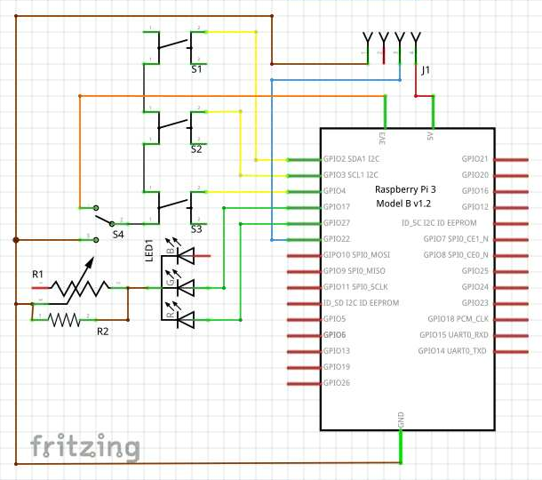

# GPIO Info
| GPIO (BOARD) Pin | GPIO (BCM) Pin | used for |
| --- | --- | --- |
| 1 | +3.3V | |
| 2 | +5V | W1 Pullup, W1 **(+)** |
| 3 | I-2 | B1 I/O |
| 4 | +5V | |
| 5 | I-3 | B2 I/O |
| 6 | 0V | |
| 7 | I-4 | B3 I/O |
| 8 | IO-14 | W1 Data |
| 9 | 0V | B1 - B3 **(&ndash;)** |
| 10 | IO-15 | |
| 11 | O-17 | D1-RED |
| 12 | IO-18 | |
| 13 | O-27 | D1-GREEN |
| 14 | 0V | |
| 15 | IO-22 | |
| 16 | IO-23 | |
| 17 | +3.3V | B1 - B3 Pullup |
| 18 | IO-24 | |
| 19 | IO-10 | |
| 20 | 0V | |

| --- | --- | --- |
| 2 | 3 | S1 reload image (menu: shutdown)|
| 3 | 5 | S2 menu (menu: exit menu)|
| 4 | 7 | S3 reload header (menu: close GUI)|
| +5V | 1 | power supply for 433MHz RF Module (and B1/B2/B3 - capacitive sensors instead of switches) |
| +3.3V | 17 |  reference for the gpios (you can toggle it with the jumper) |
| 0V | 6 | ground for the 433MHz RF Module |
| 0V | 9 | reference for the gpios (you can toggle it with the jumper) and ground for the statusLED |
| 17 | 11 | statusLED Red |
| 27 | 13 | statusLED Green |
| 22 | 15 | 433MHz RF Modules (Transmitter or Receiver) or w1 bus |
# SmartMirrorHAT Part list
| No. | Amount | Part description | details
| --- | --- | --- | --- |
| 1. | 1 | female pin headers | 2x10 0° 2.54mm |
| 2. | 1 | female pin headers | 1x4 90° 2.54mm |
| 3. | 1 | male pin headers | 1x3 0° (for jumper) |
| 4. | 1 | jumper cabs | 1x2 2.54mm |
| 5. | 1 | potentiometer | (play a bit around with the values I've used any from a kit. min: ~500Ω, max: ~30kΩ) |
| 6. | 1 | resistor | (play a bit around with the values I've used 10kΩ - and it's not very good :P) |
| 7. | 3 | resistors | +/-5% 10kΩ (10000 Ohm) |
| 8. | 4 | PCB connectors and cables | [like those](https://www.reichelt.com/PCB-Connectors/PS-25-3W-BR/3/index.html?ACTION=3&GROUPID=7525&ARTICLE=14828) |
| 9. | 1 | Display panel (eg old laptop), driverboard (eBay or so), power supply and HDMI cable ||
| 10. | 1 | Rpi power supply | 5.1V 2.5A |
# Circuits & Plans
## Circuit 1:

